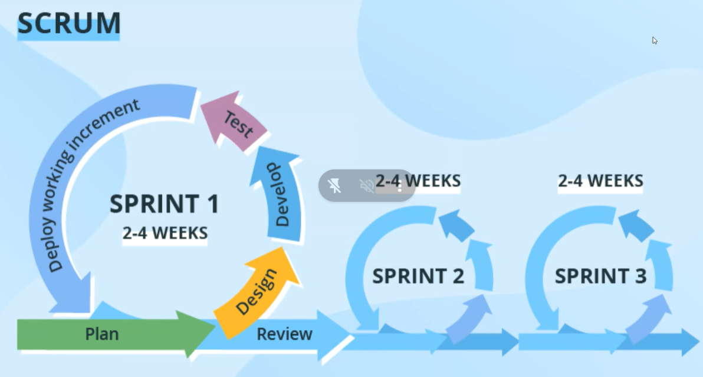

# All about the web browser

## Browser attacks

war 1 - netscape and ie  
war2 - ie and chrome

## 3 layer arch

1.  fe
1.  be
1.  db

IMG BANNER

```css
.banner{
           height:100%;
           width: 100%;
           background:aqua;
           object-fit:cover;
       }
       .container{
           height:300px;
           width:100%;
       }

   </style>
</head>
<body>
   <div class="container">
   
   </div>

```

> highlight txt use >  
> double space for new line or lne breaker.

img tag -> alt attribute

- alternative text wen img doesnt work
- improving the search engine optimization.
- visual impact for disable

First Contentful Paint  
Largest Contentful Paint

webp --compress the image and maintain good quality (https://squoosh.app/)  
logos are maded by svg (freepic)

> JAVASCRIPT

console.log(); ---- to print  
.name ----------dot syntax  
["age"]---box syntax

only in VAR we can re declare the value but not in LET , CONST  
 var name=shreya  
 var name = shre

reassign of value is only allowed in var,let
var name=shreya  
name=shre --similar with let
push adds val at the end of the array

**hi**------bold
re creating of a variable -- redeclare  
 assigning new val to the varialbe --- reassign

 >camleCase--- rules to write down the variables ie highRatedBooks()

> SCOPE:
> LIFE TIME OF A VARIABLE

let variable cant be worked outside of the block {}
var can be accessed out of the block since it has lifetime

undefine is the value (wen we wont assign a val we get that its )
not defined is the error

declare func --- function fun(){code }  
func cant work out of the block

parseInt converts to num------ console.log(x1 + parseInt(x2));  
console.log(x1 + +x2);

null+5-----------o/p is 5 null is converted to 0  
[]+[]----------''  
4 \* "5a"--------Nan (wen it cant be converted to nu it showa notanumb)  
==------compare (check for the value) converstion occurs  
===------(checks directly no convertion)
=== works faster than ==

#types of functions  
normal function  
arrow function

function can be exit 2 way that is by calling return and

> arrow function  
>  const double =(n)=>n\*2; // can be declare wen its in single line

#why to use functions?  
DRY--DONT REPEAT YOURSELF is a thumb rule.  
no repeations,reuseability,error identify,readability ,modular---divide into chunks  
code quality:5 pillars ---

- readability-75% 
- maintainability-code dept
- extensibility
- testability
- performance

copy by reference -------- copy of adress  
copy of value ------[....x1]; spread on values  

different types of FOR LOOPS:  
 - for loop
- for in 
- for of 

>> AGILE: Stake holders- they are the one responsible for make of the prj . they will bw pull if anything goes wrong

>>SDLC  
 - ANALYSIS
 - DESIGN
 - DEVELOPMENT
 - TESTING
 - DEPLOYMENT
 - MAINTENANCE  


waterfall---migration prjs
agile------  
scrum--implementation of agile  

story points: no of days assigned to complete the task , they will be in fibonocci series  
sprint planning -- will be planned in 1 hr  

burn down chart--- states the progress of the employee, that is wether he is working or not,or completeing the work at end  
### tool to manage the scrum---kanban board    
